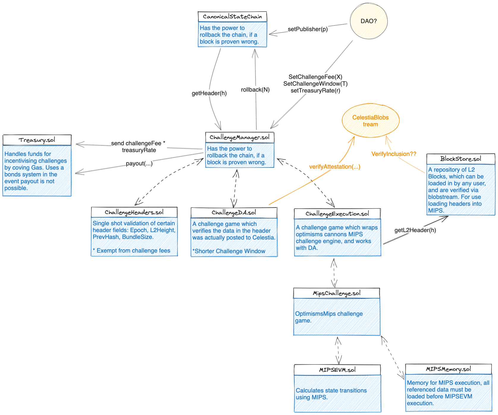
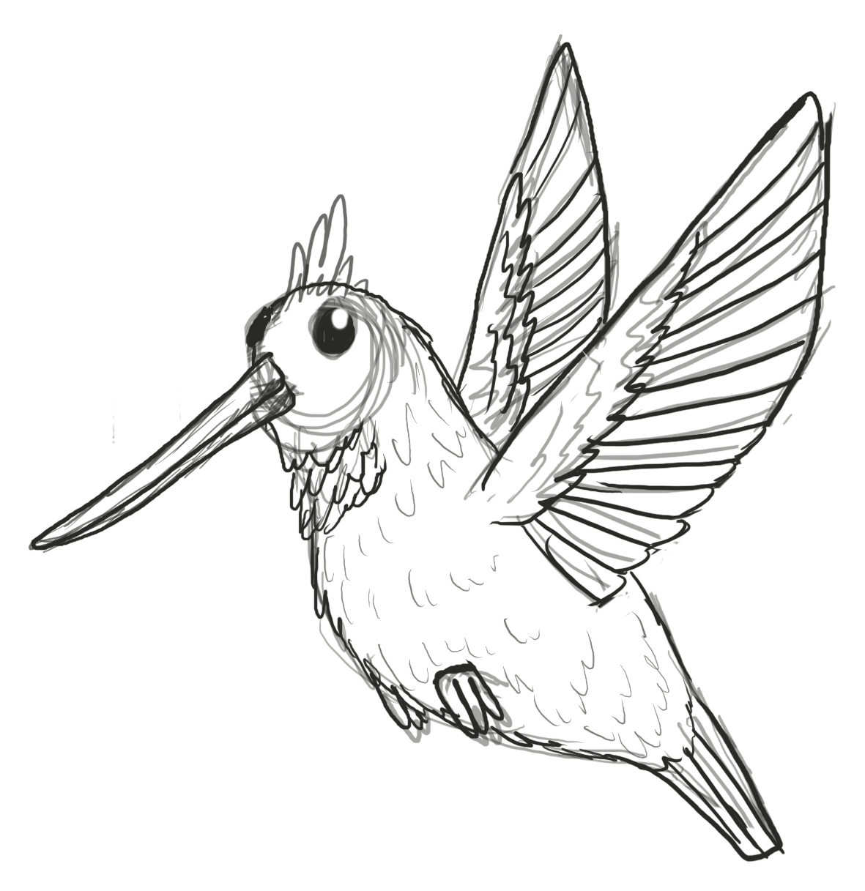

# Hummingbird contracts

This repo contains smart contracts for the Hummingbird project. Work in progress.

## Usage

To update go bindings run:

```bash
npx hardhat gobind 
```

## Overview



```
CanonicalStateChain.sol – Where the rollup chain is stored.
Treasury.sol – Where fees are stored and challenges can be reimbursed.
Challenge
  └ ChallengeManager.sol – A Collection of the challenges below that can be called to rollback the chain if needed.
  └ ChallengeBase.sol – Base contract for all challenges, allows getting and setting the challenge window, and the challenge fee.
  └ ChallengeHeader.sol – Challenge a block header for validity.
  └ ChallengeDataAvailability.sol – Claim that block data is unavailable.
  └ ChallengeExecution.sol – Claim incorrect stateroot using mips.
  └ mips – Contains MIPS contracts.
```

## Challenges Overview

Challenges allow anyone to challenge the validity of a block. If a block is found to be invalid, the chain is rolled back to the previous block.

Most challenges require a challenge fee, which is paid to the winner of the challenge. This mechanism is used to deincentivize
frivolous challenges, and reimburse the defender the cost of providing proof (GAS).

Challenges must be made within a valid challenge window. This is a time window that starts when the block is published, and ends after a certain time has passed. If a challenge is made outside of this window, it will be rejected. The window may be different for certain challenges.

### ChallengeHeader:

Contract that lets anyone challenge a block header against some basic validity checks. The following checks are made:

1.  The epoch is greater than the previous epoch.
2.  The l2Height is greater than the previous l2Height.
3.  The prevHash is the previous block hash.
4.  The bundle size is less than the max bundle size.

If any of these checks fail, the chain is rolled back to the previous block.

Just like with all challenges, the challenge window must be open, however there is no challenge fee.

### ChallengeDataAvailability

This a challenge game, anybody can challenge the DA of a block.

Once initiated the defender (block publisher) must provide proof within a shorted time window. (This proof is verified via the blobstream contract). If they fail to do so, the challenger wins the challenge and the chain is rolled back to the previous block.

The window on this challenge starts 80 mins after the block is published, and ends 6 hours after the block is published. The delay to the start of the challenge window gives enough time for celestia to validate the data and publish the proof. The shortened end window, gives time for subsequent challenges to after data availability is proven.

### ChallengeExecution

**Incomplete**, but will call the MIPS challenge game to computer the correct stateRoot and compare it to the one in the block header. If the header is incorrect the block will be rolled back.



### TODO

- [ ] ChallengeExecution
- [ ] MultiChainMessenger
- [ ] Add TxQueue to CanonicalStateChain.
- [ ] ChallengeTxInclusion
